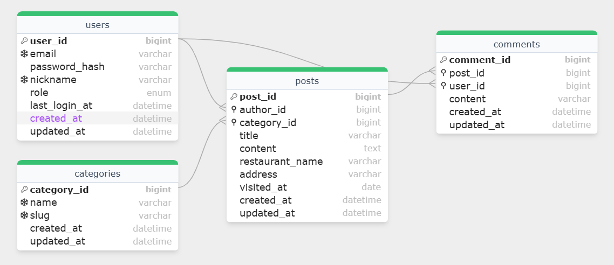
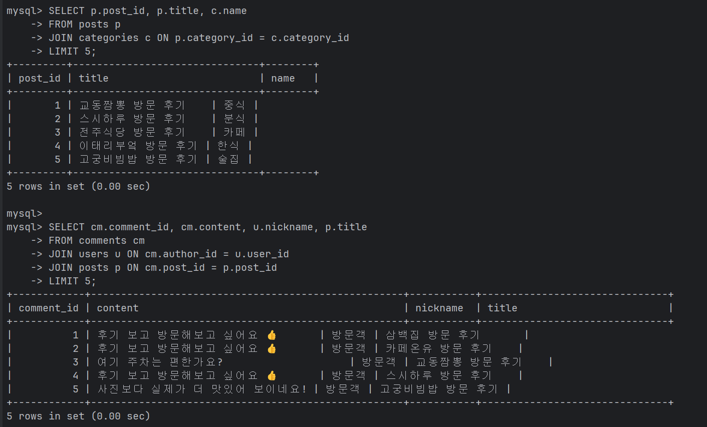

---
# 📙 ERD 설계

## 1) User 엔티티 정의표

| 컬럼명           | 타입                   | PK | FK | NN | UQ    | 기본값               | 설명                 |
| ------------- | -------------------- | -- | -- | -- | ----- | ----------------- | ------------------ |
| user_id       | BIGINT               | ✅  |    | ✅  |       | AUTO_INCREMENT    | 사용자 식별자            |
| email         | VARCHAR(255)         |    |    | ✅  | ✅     |                   | 로그인용 이메일           |
| password_hash | VARCHAR(255)         |    |    | ✅  |       |                   | 비밀번호 해시값(평문 저장 금지) |
| nickname      | VARCHAR(50)          |    |    | ✅  | ✅(권장) |                   | 화면 표시용 이름          |
| role          | ENUM('ADMIN','USER') |    |    | ✅  |       | 'USER'            | 관리자/일반 사용자 구분      |
| created_at    | DATETIME             |    |    | ✅  |       | CURRENT_TIMESTAMP | 생성 시각              |
| updated_at    | DATETIME             |    |    | ✅  |       | CURRENT_TIMESTAMP | 수정 시각(업데이트 시 갱신)   |
| last_login_at | DATETIME             |    |    |    |       | NULL              | 마지막 로그인 시각         |

**관계**

* User(1) : Post(N) → `Post.author_id`
* User(1) : Comment(N) → `Comment.user_id`

---

## 2) Category 엔티티 정의표

| 컬럼명         | 타입          | PK | FK | NN | UQ | 기본값               | 설명                         |
| ----------- | ----------- | -- | -- | -- | -- | ----------------- | -------------------------- |
| category_id | BIGINT      | ✅  |    | ✅  |    | AUTO_INCREMENT    | 카테고리 식별자                   |
| name        | VARCHAR(50) |    |    | ✅  | ✅  |                   | 카테고리 이름(중복 방지)             |
| slug        | VARCHAR(80) |    |    | ✅  | ✅  |                   | URL/식별용 문자열(예: korean-bbq) |
| created_at  | DATETIME    |    |    | ✅  |    | CURRENT_TIMESTAMP | 생성 시각                      |
| updated_at  | DATETIME    |    |    | ✅  |    | CURRENT_TIMESTAMP | 수정 시각                      |

**관계**

* Category(1) : Post(N) → `Post.category_id`

---

## 3) Post 엔티티 정의표

| 컬럼명             | 타입           | PK | FK                      | NN | UQ | 기본값               | 설명          |
| --------------- | ------------ | -- | ----------------------- | -- | -- | ----------------- | ----------- |
| post_id         | BIGINT       | ✅  |                         | ✅  |    | AUTO_INCREMENT    | 게시글 식별자     |
| author_id       | BIGINT       |    | ✅(User.user_id)         | ✅  |    |                   | 작성자(관리자 계정) |
| category_id     | BIGINT       |    | ✅(Category.category_id) | ✅  |    |                   | 카테고리        |
| title           | VARCHAR(150) |    |                         | ✅  |    |                   | 글 제목        |
| content         | TEXT         |    |                         | ✅  |    |                   | 글 본문        |
| restaurant_name | VARCHAR(100) |    |                         | ✅  |    |                   | 가게명         |
| address         | VARCHAR(255) |    |                         |    |    | NULL              | 주소(선택)      |
| visited_at      | DATE         |    |                         |    |    | NULL              | 방문일(선택)     |
| created_at      | DATETIME     |    |                         | ✅  |    | CURRENT_TIMESTAMP | 작성 시각       |
| updated_at      | DATETIME     |    |                         | ✅  |    | CURRENT_TIMESTAMP | 수정 시각       |

**관계**

* Post(1) : Comment(N) → `Comment.post_id`

---

## 4) Comment 엔티티 정의표

| 컬럼명        | 타입           | PK | FK              | NN | UQ | 기본값               | 설명           |
| ---------- | ------------ | -- | --------------- | -- | -- | ----------------- | ------------ |
| comment_id | BIGINT       | ✅  |                 | ✅  |    | AUTO_INCREMENT    | 댓글 식별자       |
| post_id    | BIGINT       |    | ✅(Post.post_id) | ✅  |    |                   | 어느 글의 댓글인지   |
| user_id    | BIGINT       |    | ✅(User.user_id) | ✅  |    |                   | 댓글 작성자       |
| content    | VARCHAR(500) |    |                 | ✅  |    |                   | 댓글 내용(길이 제한) |
| created_at | DATETIME     |    |                 | ✅  |    | CURRENT_TIMESTAMP | 작성 시각        |
| updated_at | DATETIME     |    |                 | ✅  |    | CURRENT_TIMESTAMP | 수정 시각        |

---

## 5) ERD 관계 요약(텍스트)

* **User 1 — N Post**
* **Category 1 — N Post**
* **Post 1 — N Comment**
* **User 1 — N Comment**

---

## 6) DB 데이터 사례

